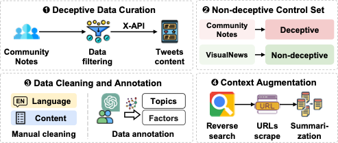

# XNote: Benchmarking Automated Community Notes Generation for Image-based Contextual Deception

XNote is a real-world benchmark of X posts paired with Community Notes and external context, with annotations for topics and deceptive factors. This repository evaluates frontier large vision-language models (LVLMs) on two tasks: deception detection and note generation.

[](https://huggingface.co/datasets/majinwakeup30/XNote)

## Dataset: XNote

The **XNote** dataset is constructed in four stages:
1. deceptive data curation
2. non-deceptive control set addition
3. data cleaning and annotation
4. context augmentation via reverse image search



Dataset references:
- `dataset/readme.md`: detailed dataset description and usage notes
- `dataset/id_only_metadata.jsonl`: core metadata file
- `dataset/data_collection.png`: data construction pipeline figure

## Benchmarking LVLMs

We provide scripts for benchmarking LVLMs, all the LVLM backbones are from Hugging Face.

Supported `--model_name` options:
- `gemma`
- `internvl`
- `llavaonevision`
- `qwen`
- `vila`

Use `--use_context` to include external context in evaluation.

```bash
python test_baseline.py --model_name gemma --use_context
```

Test with OpenAI GPT API, use `--reverse-search` to enable web search tool.
```bash
python test_gpt.py --model_name gpt-5 --reverse-search
```

Evaluation scripts:

```bash
# Deception detection
python eval_cls.py --model_name gemma --use_context

# Note generation
python eval_generation.py --model_name gemma --use_context
```